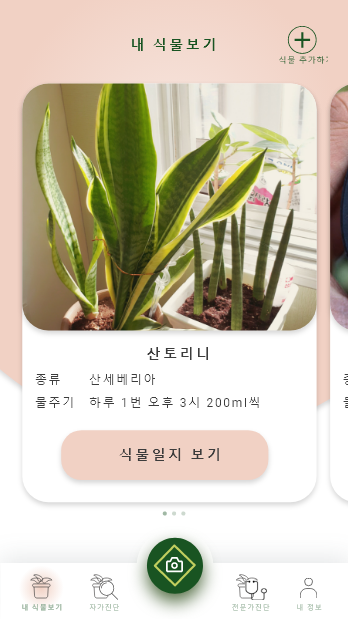
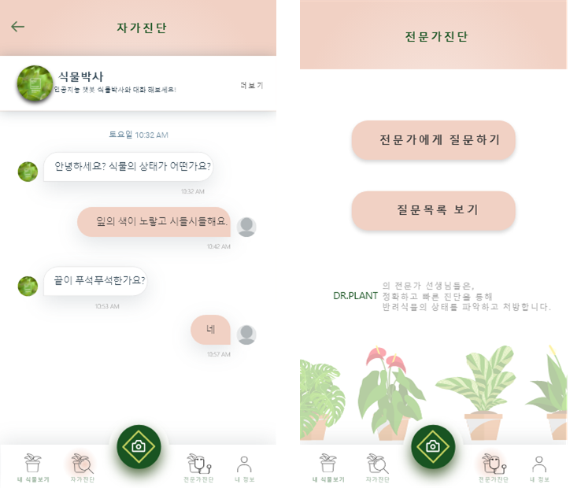

# Project: Dr.plant
### used tool
 
-   android studio
-   eclipse: spring server
-   arduino: soil humidity, temperature sensor, ethernet module

### Project Overview

It is an Android app that can manage plants.  
First, arduino sensors measure the humidity and temperature of a plant.
Then server that got plant's condition from the server notify the information to user's application.
Second, it provides a service to diagnose and treat plant conditions using common symptoms of plants.
Third, it provides a communication space for sharing plant information or status.
In addition, if qr code is recognized, the plant's condition can be viewed in camera image and text.

# Program Imgae

### Main Image

### diagnose

